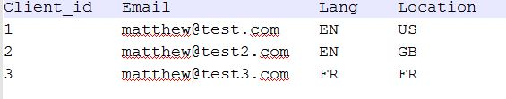
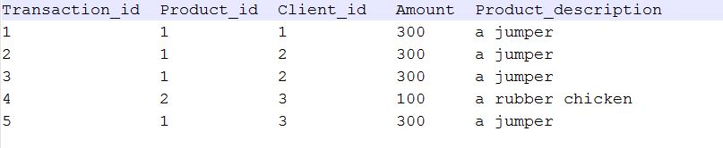

# ApacheSparkExamples
examples of pap reduce jobs treated by Apache spark.

Two jobs are created here which run on the following datasets as input:

**user_test.txt**

**transactions_test.txt**

## Sales job1 (SalesJob.scala)

This job finds the number of unique locations in which each product has been sold.

## Sales job2 (SalesJob2.scala)

This job finds the location where the max number of each product has been sold.

## Run

Run the `SalesJob` & `SalesJob2` objects using your IDE (ex. intelliji) and the outputs will be stored in `output` & `output2` folders respectively.

## Output

 - Sales job1
 
     (1,3)  
     (2,1)

 - Sales job2
 
     (a jumper,GB)  
     (a rubber chicken,FR)

 
        
